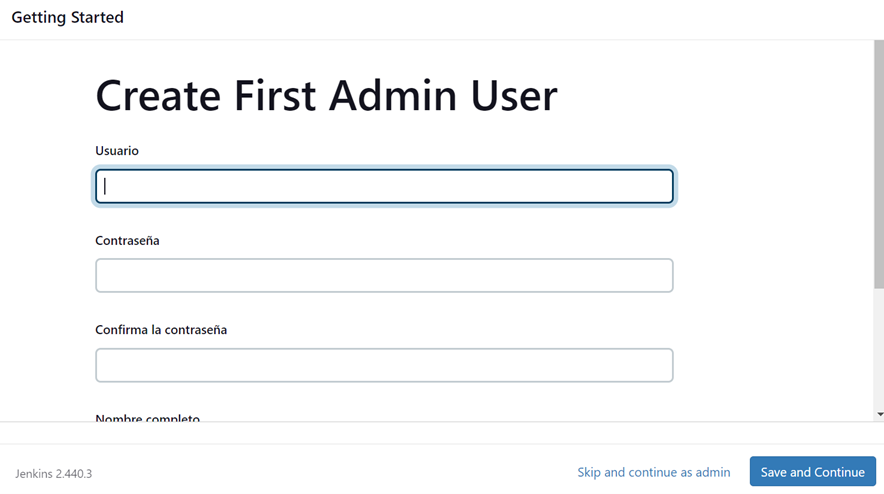

# Jenkins Lab-Paso a paso _:smile:_

## Ejecutar Docker Compose

Es necesario tener Docker Compose en la maquina donde se va a trabajar, si lo tienes continua los pasos:

1. Se navega hasta la ubicación donde se encuentra el archivo `docker-compose.yml`.

**Nota:** Se requiere añadir un volumen al archivo `docker-compose.yml` para garantizar la persistencia de los datos del contenedor de Jenkins en caso de fallos. Además, se debe exponer el puerto ,3000 en esta solución, ya que se trata de una aplicación web desarrollada con Node.js. Es importante tener en cuenta que, por defecto, Jenkins no utiliza el puerto  3000.

```
version: '3.7'

services:
  jenkins:
    image: jenkins/jenkins:lts
    ports:
      - "8080:8080"
      - "3000:3000"
    volumes:
      - jenkins_cami:/var/jenkins_home

volumes:
  jenkins_cami:
    name: jenkins_cami
```

2. Se ejecuta el siguiente comando en la terminal para iniciar los contenedores definidos en el archivo `docker-compose.yml`:

```bash
docker-compose up -d
```


#### Se verifica el estado del contenedor usando el comando `docker ps`


3. Extraer passwords

```bash
docker logs id_container
```

#### Se debe buscar el siguiente apartado donde se muestra la contraseña de acceso


Otra manera de extraer la contraseña es con el comando:

```bash
docker exec id_container cat /var/jenkins_home/secrets/initialAdminPassword
```


### Se ingresa a la página de Jenkins para iniciar su configuración
 
 La url para ingresar es `localhost:8080`

Se debe usar la contraseña extraida anteriormente para ingresar como administrador


Se elige el tipo de instalación de jenkins a gusto


Se selecciona Node.js en la lista de plugins a instalar (No se debe deseleccionar los que vienen seleccionados por defecto), luego se iniciará la descarga de los plugins y sus dependencias


Se crea el usuario administrador de jenkins para usarlo en futuros ingresos



En la página inicial de Jenkins, se busca en el menu vertical la opción `administrar jenkins` o `manage jenkins`


Se da click a la opción `tools` y configuramos la herramienta del proyecto agregando a esta `Node.js` versión `10.15.2`


 


En el menu vertical se selecciona `nueva tarea` o `new item` para crear el projecto, seguido se asigna un nombre y el tipo `freestyle project` o `proyecto estilo libre`


Se agrega una descripción al proyecto
Cambiamos la fuente del código a `Git` y pegamos la url del repositorio de github


_En este caso no se configuran `triggers` o `disparadores`_

En `Entorno de Compilación` o `Build Environment` se selecciona `proporcionar node & npm bin/ a la carpeta PATH` o `provide node & npm bin/ folder to PATH`


Se agrega un nuevo `Paso de Compilación` o `Build Step` y en el menu desplegable se selecciona `Execute shell` o `Ejecutar Script de Shell` y se agregan los siguientes comandos para su ejecución:

```
npm install
npm run build
node app.js
```


CLick en `guardar` o `save`


En la página principal de Jenkins se ejecuta manualmente el proyecto que se acaba de crear


Al verificar la consola del proyecto se ve los posibles errores en la ejecución o los mensajes que se lanzan durante la compilación


Ahora bien, se puede ingresar a la app usando la url `localhost:3000`


Finalmente, al ingresar a la ip del servidor se  puede evidenciar la aplicación corriendo correctamente


## <b> Made by </b>

+ [Camilo González Velasco](https://github.com/camilogonzalez7424 "Camilo G.")


[](https://forthebadge.com)